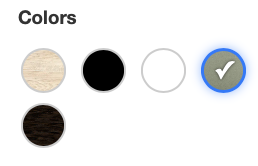

# InterStore

A scalable, full-featured online store platform supporting both modern REST APIs for business integration and classic admin/database views via MVC.

## Project Idea

InterStore is designed as a robust e-commerce platform that combines flexible product catalog management, advanced filtering, and seamless integration with external business systems. It supports both internal admin/database views (Spring MVC + Thymeleaf) and REST API endpoints for external service consumption, enabling a versatile solution for online retail.

## Features

- Multi-layer architecture: Controller (MVC & REST), Service, Repository, DTO, Model
- Dual interface:  
  - **Spring MVC + Thymeleaf** for admin and database-driven views  
  - **REST API** for external services and frontend integration
- Flexible product catalog: multi-level categories, brands, tags, colors, dimensions
- Advanced product filtering and search (by price, tag, color, size, brand, category)
- Robust file/image management for products and attributes
- Automated database migrations with Flyway
- Strict validation, error handling, and user-friendly feedback
- Fully automated CRUD operations for all entities
- Clean code practices, modularity, and maintainability
- Responsive/adaptive frontend using HTML and CSS

## My Role

- Sole developer and architect of backend and admin UI
- Designed and implemented multi-layer architecture (Spring Boot MVC & REST, Thymeleaf, Service, Repository, DTO, JPA/Hibernate)
- Built advanced search, filtering, file/image upload, entity CRUD, and validation logic
- Automated schema changes and migrations using Flyway
- Applied clean code principles, high modularity, and extensibility

## Tech Stack

- Java 17+
- Spring Boot, Spring MVC, Spring Data JPA (standard and custom @Query), Hibernate
- Flyway (database migrations)
- Thymeleaf (server-side rendering)
- REST API
- Lombok
- Maven
- HTML, CSS (responsive/adaptive design)
- OOP, DTO/entity mapping, exception handling

## Author

[rusleak](https://github.com/rusleak)

